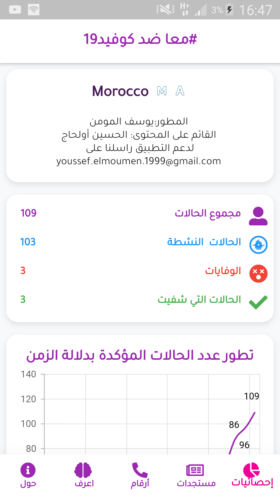

# Project info
this project called COVID19 MAROC and its under Creative Commons (CC) license
.This app is for providing realtime statistics about corona virus in Morocco
# To do
- [x] Basic Features 
- [x] Add firebase as backend 
- [ ] Change data source from F. Database to API  
- [ ] Expand the app to Mutli Country 
# version2 details 
API to use : https://github.com/mohssineAboutaj/moroccovid-19-api

# App screnshots
here is some screenshots from the old version 

